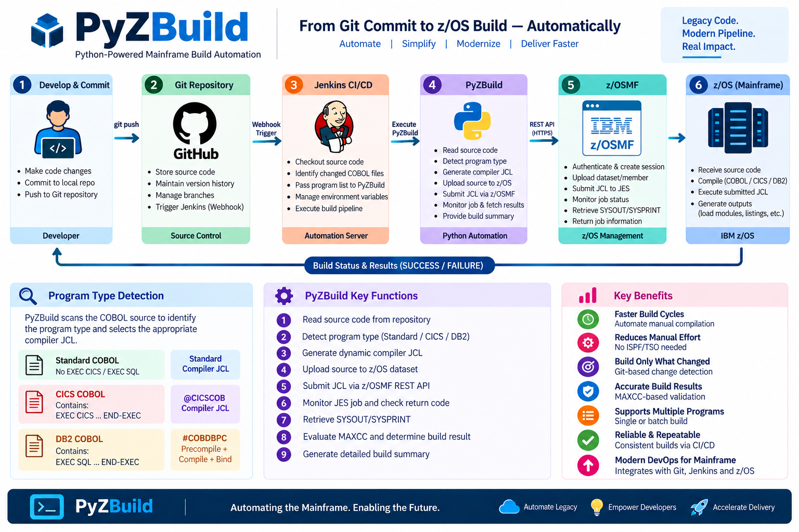

# 🚀 🐍 PyZBuild | Mainframe Build Automation

<p align="center">
  
</p>

---

## 📌 Executive Summary

PyZBuild is a Python-based Mainframe build automation project that uses IBM z/OSMF REST APIs to automate traditional z/OS build activities. The project demonstrates how Python and REST-based automation can interact with Mainframe services, submit build jobs, monitor JES execution, retrieve output, and provide build results.

- 🎯 **Business Problem:** Traditional Mainframe builds often involve manual JCL submission, job monitoring, spool inspection, and return-code validation.
- 🛠️ **Approach:** Developed PyZBuild using Python and z/OSMF REST APIs to automate the interaction between modern automation tooling and z/OS build processes.
- 📊 **Business Impact:** Provides a reusable foundation for Mainframe DevOps and CI/CD by reducing repetitive manual build activities and enabling programmatic build execution.

---

# 🚨 Business Problem

Organizations often depend on established Mainframe build processes that require multiple manual activities:

- Manual JCL preparation and submission
- Manual JES job monitoring
- Manual spool output inspection
- Manual return-code validation
- Repetitive build execution across applications
- Difficulty integrating traditional Mainframe builds into modern CI/CD pipelines

**The challenge:** Modernize the build and delivery process while continuing to leverage existing Mainframe infrastructure and applications.

---

# 🎯 Objective

1. Automate Mainframe build execution using Python
2. Communicate with z/OS through IBM z/OSMF REST APIs
3. Submit JCL build jobs programmatically
4. Monitor JES job execution and status
5. Retrieve job and spool output
6. Analyze build return codes and identify success/failure
7. Create a foundation for Mainframe CI/CD integration

---

# 🏗️ Solution Architecture


* **Python Automation** - Controls the Mainframe build workflow
* **z/OSMF REST APIs** - Provides programmatic interaction with z/OS
* **JCL** - Defines the Mainframe build process
* **JES** - Executes and manages submitted jobs
* **Spool / Job Output** - Provides build status, messages, and return codes
* **CI/CD Integration Layer** - Provides a foundation for automated Mainframe delivery

---

# 📊 Application Flow

1. Developer or CI/CD pipeline triggers PyZBuild
2. PyZBuild authenticates with z/OSMF
3. Python prepares or selects the required JCL
4. PyZBuild submits the JCL through z/OSMF REST APIs
5. z/OSMF creates the JES job
6. PyZBuild receives the Job ID
7. PyZBuild monitors the job status
8. Job output and spool information are retrieved
9. PyZBuild analyzes the return code
10. Build result is reported as SUCCESS or FAILURE

---

# 🛠️ Skills

### 🐍 Python Development

- Python Programming
- REST API Integration
- HTTP / HTTPS
- JSON Processing
- Exception Handling
- File Handling
- Command-line Automation
- Modular Application Design

### 🏢 Mainframe Development

- IBM z/OS
- JCL
- JES
- COBOL Build Processes
- CICS
- Db2
- Mainframe Application Development
- Mainframe Job Management

### 🔗 API & Integration

- IBM z/OSMF REST APIs
- REST API Requests / Responses
- JSON Request / Response
- Job Submission APIs
- Job Status APIs
- JES Output Retrieval
- API-based Mainframe Integration

### ⚙️ DevOps & Modernization

- Mainframe DevOps
- Build Automation
- CI/CD Concepts
- API-driven Automation
- Legacy Modernization
- Git
- GitHub
- Automated Build Workflows

### 🧰 Tools & Environment

- Python
- IBM z/OS
- IBM z/OSMF
- JES
- JCL
- Visual Studio Code
- Git
- GitHub
- REST Clients

---

# 📊 Results & Key Outcomes

The project demonstrates how traditional Mainframe build activities can be automated through Python and z/OSMF REST APIs while retaining the existing z/OS build environment.

### 🔍 Key Outcomes

- 🔗 **z/OSMF API Integration:** Connected Python automation with IBM z/OSMF REST APIs.
- ⚙️ **Build Automation:** Created a foundation for programmatic Mainframe build execution.
- 📤 **JCL Job Submission:** Enabled JCL-based build jobs to be submitted through REST APIs.
- 🔎 **Job Monitoring:** Enabled programmatic tracking of JES job execution.
- 📄 **Spool Retrieval:** Provided a mechanism for retrieving job output and build messages.
- 📊 **Return Code Processing:** Established build-result validation using job status and return codes.
- 🚀 **DevOps Enablement:** Created a foundation for integrating Mainframe builds with modern CI/CD workflows.
- ♻️ **Mainframe Investment Preservation:** Automates the existing build ecosystem instead of replacing the underlying  Mainframe platform.

### 💡 Modernization Benefits

- 🎯 **Reduced Manual Effort:** Repetitive build activities can be automated.
- 🔌 **API Accessibility:** Mainframe build operations can be controlled programmatically.
- 🚀 **CI/CD Readiness:** Provides an integration point between modern pipelines and z/OS.
- 📈 **Repeatability:** Standardizes build execution through reusable automation.
- 🔎 **Improved Visibility:** Job status, return codes, and spool output can be processed automatically.
- 🛡️ **Reduced Manual Errors:** Minimizes repetitive manual submission and monitoring activities.

---

# 🔄 Traditional vs PyZBuild

| Activity | Traditional Approach | PyZBuild |
|---|---|---|
| Build initiation | Manual | Automated |
| JCL submission | Manual | REST API driven |
| Job ID tracking | Manual | Programmatic |
| Job monitoring | Manual | Automated |
| Spool retrieval | Manual | Automated |
| Return-code validation | Manual | Automated |
| CI/CD integration | Difficult | Automation foundation |
| Repeatability | Manual process | Reusable workflow |

---

# 🧪 Testing

PyZBuild can be validated across multiple levels.

### Unit Testing

Test individual Python components such as:

- Authentication handling
- Job submission
- Job status processing
- Spool retrieval
- Return-code processing
- Error handling

### Integration Testing

Validate the complete interaction:

```text
Python
   ↓
z/OSMF
   ↓
JES
   ↓
JCL Build
   ↓
Job Output
```

### Build Validation

A successful build should verify:

- Job submission completed successfully
- Job reached completion
- Expected return code was received
- Required build steps completed
- No critical compilation errors
- No link-edit failures

---

# 🔐 Security

PyZBuild communicates with z/OSMF using authenticated REST API requests.

Sensitive information must not be hardcoded into the source code.

Recommended approaches include:

```text
Environment Variables
External Configuration
Secret Management
```

Never commit the following to GitHub:

```text
Passwords
API Tokens
Private Keys
Production Credentials
Sensitive Host Information
```

Example configuration variables:

```text
ZOSMF_HOST
ZOSMF_PORT
ZOSMF_USER
ZOSMF_PASSWORD
```

---

# 🔮 CI/CD Integration


PyZBuild provides a foundation for integrating Mainframe builds into modern CI/CD pipelines.

Future pipeline stages can include automated testing, deployment, approval gates, and notifications.

---

# 🆚 Mainframe Build Modernization

PyZBuild demonstrates that Mainframe modernization does not necessarily require rewriting existing applications.

Instead, existing Mainframe development processes can be progressively modernized:

```text
Traditional Mainframe Build
          │
          ▼
      z/OSMF APIs
          │
          ▼
    Python Automation
          │
          ▼
       CI/CD
          │
          ▼
 Modern Delivery Process
```

This approach allows organizations to retain their Mainframe applications while modernizing the surrounding development and delivery workflow.

---

# 🔮 Future Enhancements

- Git-based source deployment
- Automated JCL generation
- Multi-step build pipelines
- COBOL compile automation
- Db2 precompile automation
- Link-edit automation
- Automatic spool parsing
- Intelligent build-error detection
- Build history and reporting
- GitHub Actions integration
- Jenkins integration
- Azure DevOps integration
- Automated deployment
- Build artifact management
- Build notifications
- Dashboard for build history

---

# 👨‍💻 Author

**Parthi B**

Mainframe Developer | Mainframe Modernization | DevOps Automation

### Areas of Interest

- COBOL
- CICS
- Db2
- z/OS
- z/OSMF
- z/OS Connect EE
- Python
- REST APIs
- Mainframe Modernization
- DevOps
- CI/CD

---

# ⭐ Project Vision

> **PyZBuild bridges traditional Mainframe build processes with modern API-driven automation and DevOps practices.**

The goal is not to replace the Mainframe, but to **automate and modernize the way Mainframe applications are built, tested, and eventually delivered.**

---

**Status:** 🚧 Mainframe DevOps / Modernization POC

**Project:** `PyZBuild`

**Platform:** IBM z/OS

**Automation:** Python + z/OSMF REST APIs

**Source Control:** Git / GitHub

**Last Updated:** September 2026
